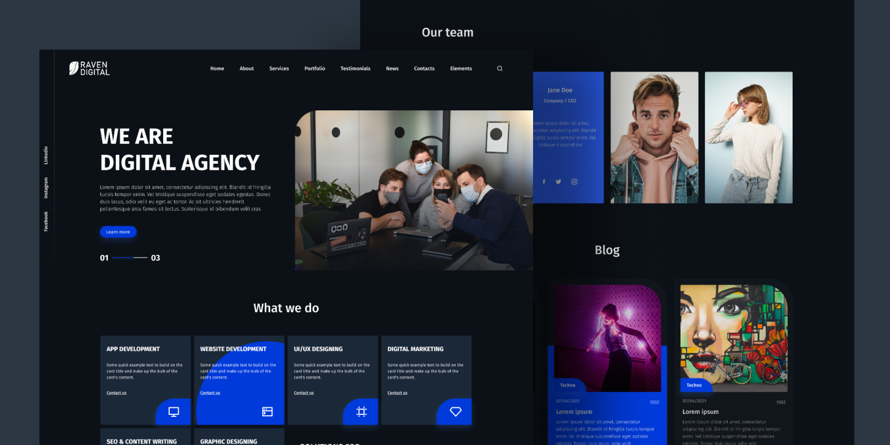

# Design Agency

Este repositório contém o código para o design de uma agência de criação de marcas, sites, marketing digital e outras coisas, desenvolvido utilizando **React**, **TailwindCSS**, e o bundler **Vite**. O objetivo deste projeto é me utilizar de um design do Figma já existente e transformá-lo em um site real.

## Preview: [website](https://raven-digital-pqeh.vercel.app/)



## 📋 Funcionalidades

- **Design Responsivo**: O site se adapta a diferentes tamanhos de tela, proporcionando uma experiência agradável tanto em dispositivos móveis quanto em desktops.
- **Seções Dinâmicas**: Inclui seções como "About", "Portfolio", "Testimonials", e um formulário de contato funcional.
- **Animações Suaves**: Uso de transições e animações leves para melhorar a experiência do usuário.
- **Formulário de Contato**: Um formulário de contato e informações para entrar em contato.

## 🛠 Tecnologias Utilizadas

### Frontend

- **React**: Framework JavaScript para construir interfaces de usuário dinâmicas.
- **TailwindCSS**: Biblioteca de utilitários CSS para estilização rápida e responsiva.
- **React Icons**: Conjunto de ícones para uso no React.
  
### Bundler

- **Vite**: Um bundler rápido e leve para desenvolvimento e build do projeto.

### Linting e Formatação

- **ESLint**: Ferramenta de linting para garantir a consistência de código e seguir as melhores práticas.
- **Prettier**: Utilizado indiretamente pelo ESLint para garantir a formatação de código.

## 📐 Decisões de Design

### Estrutura do Projeto

Decidi separar cada seção do site (e.g., "About", "Portfolio", "Testimonials") em componentes React independentes. Isso melhora a legibilidade e modularidade do código, permitindo fácil manutenção e expansão do projeto no futuro.

### Estilização com TailwindCSS

Optei por usar o **TailwindCSS** pela sua flexibilidade em criar designs responsivos rapidamente, e pela facilidade em manter a consistência em todo o site. Com Tailwind, não precisei criar arquivos CSS separados, o que me permitiu concentrar mais na lógica e menos na estilização manual.

### Vite para Desenvolvimento Rápido

Escolhi o **Vite** como bundler por sua velocidade no ambiente de desenvolvimento e na build. Ele permite hot reloading eficiente e compila rapidamente tanto no desenvolvimento quanto no processo de produção.

### Uso de Ícones

Os ícones utilizados no site são da biblioteca **React Icons**, que oferece uma vasta coleção de ícones populares. Eles foram usados para complementar o design visual e aumentar a clareza das informações.

## 🎨 Inspiração e Créditos

Este portfólio foi inspirado em um design que encontrei durante a minha pesquisa. Abaixo estão os créditos ao design original:

- **Design Original**: [Link para o design](https://www.figma.com/community/file/1249963830138731402/yumi-web-agency)
- **Autor(a) do Design**: [Ismoilbek Ma'murov](https://www.figma.com/@mamurov)

Sinto-me muito grato(a) por poder utilizar este design como referência. Ele serviu de base para criar uma experiência visual agradável e moderna.

## ⚙️ Instalação

### Pré-requisitos

- Node.js (versão 14.x ou superior)
- npm (ou yarn)

### Passos para rodar o projeto

1. Clone o repositório:

   ```bash
   git clone https://github.com/crishard/raven-digital.git
   ```

2. Navegue até o diretório do projeto:

    ```bash
    cd raven-digital 
    ```

3. Instale as dependências:

     ```bash
    npm install
    ```

4. Inicie o servidor de desenvolvimento:

     ```bash
    npm run dev
    ```

5. Acesse <http://localhost:3000> no seu navegador para visualizar o projeto.

### Build para Produção

Para criar a versão de produção otimizada do site, execute:

  ```bash
   npm run build
  ```

O projeto será compilado e os arquivos otimizados estarão disponíveis na pasta dist.
